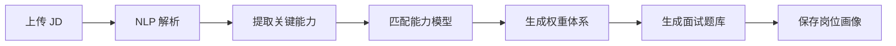
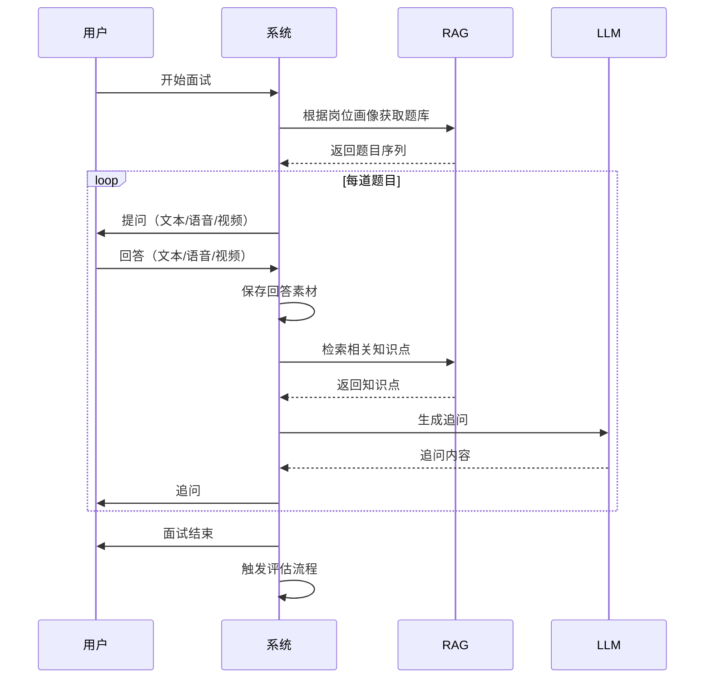
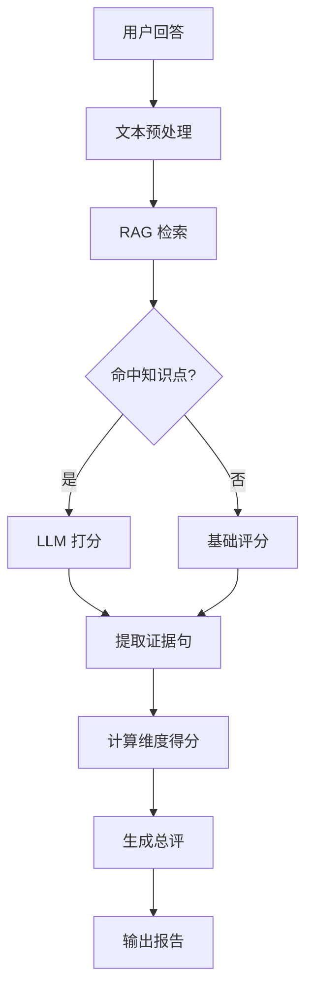
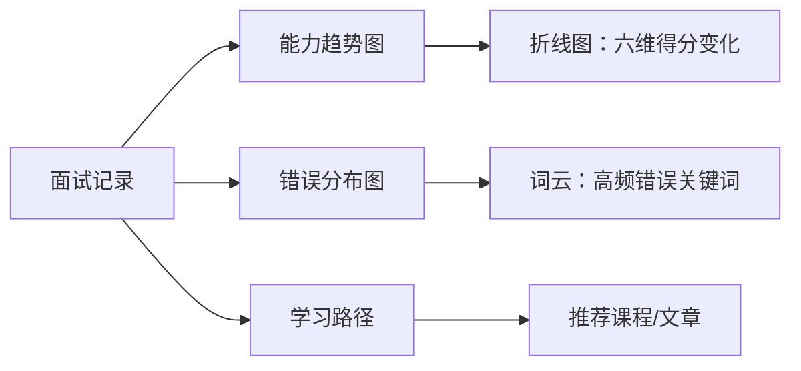
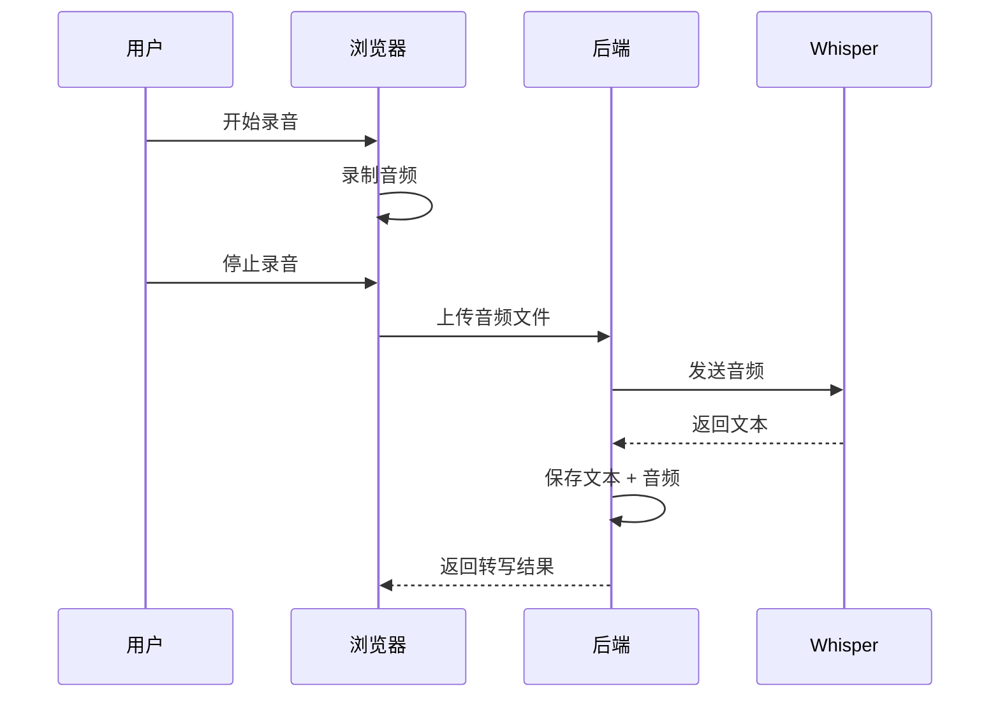
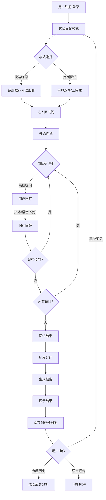
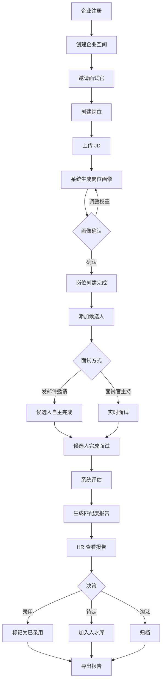
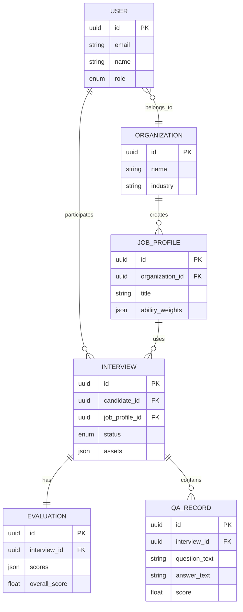

# AIPM-Scan 产品需求文档 (PRD)

> **版本**：v2.0  
> **更新日期**：2026-01-10  
> **文档状态**：可执行开发版本  
> **目标读者**：开发团队、产品团队、AI 编程辅助工具

---

## 📋 目录

1. [项目概述](#一项目概述)
2. [用户角色与权限](#二用户角色与权限)
3. [核心功能模块](#三核心功能模块)
4. [技术规范](#四技术规范)
5. [详细交互流程](#五详细交互流程)
6. [数据结构设计](#六数据结构设计)
7. [成功指标](#七成功指标-kpis)

---

## 一、项目概述

### 1.1 产品定位

**AIPM-Scan** 是一款同时服务 **C 端求职者**和 **B 端企业**的智能面试系统，专注于 **AI 产品经理**岗位的能力评估与人岗匹配。

> **核心价值主张**
> 
> 不是通用 AI 面试产品，而是：
> - 🎯 **AI 产品经理能力识别系统**
> - 🤝 **岗位匹配与招聘决策平台**
> - 📈 **职业成长档案工具**

### 1.2 目标用户

| 用户类型 | 典型画像 | 核心需求 |
|---------|---------|---------|
| **C 端求职者** | AI PM 求职者、转岗人员 | 模拟面试练习、能力评估、成长追踪 |
| **B 端企业** | 科技公司 HR、招聘团队 | 候选人评估、岗位匹配、决策支持 |
| **面试官** | 企业内部面试官 | 协同面试、评价管理 |
| **管理员** | 系统运营团队 | 知识库维护、数据分析 |

### 1.3 产品目标

#### 短期目标（3-6 月）
- ✅ 完成 MVP 开发（核心评估引擎 + C 端体验）
- 🎯 获取 500+ 注册用户
- 📊 验证能力评估模型准确性 ≥ 75%

#### 中期目标（6-12 月）
- 🏢 服务 10+ B 端企业客户
- 📈 月活用户 ≥ 5,000
- 💼 完成 1,000+ 面试评估

#### 长期目标（12+ 月）
- 🌟 成为 AI PM 能力标准定义者
- 🔄 建立数据飞轮（面试数据 → 模型优化）
- 🚀 横向扩展至其他 AI 相关职位

---

## 二、用户角色与权限

### 2.1 角色定义

| 角色 | 权限范围 | 主要功能 |
|-----|---------|---------|
| **C 端用户** | 个人账号 | 模拟面试、查看评估报告、成长档案 |
| **B 端企业账号** | 企业空间 | 创建岗位、管理候选人、导出报告 |
| **面试官** | 企业空间成员 | 发起面试、参与评价、查看候选人 |
| **管理员** | 全局 | 知识库管理、系统配置、数据分析 |

### 2.2 权限矩阵

| 功能 | C 端用户 | 面试官 | 企业管理员 | 系统管理员 |
|-----|---------|-------|-----------|-----------|
| 参加模拟面试 | ✅ | ✅ | ✅ | ✅ |
| 查看个人报告 | ✅ | ✅ | ✅ | ✅ |
| 创建岗位画像 | ❌ | 部分 | ✅ | ✅ |
| 管理候选人 | ❌ | ✅ | ✅ | ✅ |
| 导出企业报告 | ❌ | ❌ | ✅ | ✅ |
| 维护知识库 | ❌ | ❌ | ❌ | ✅ |
| 查看数据分析 | 个人 | 部分 | 企业 | 全局 |

---

## 三、核心功能模块

### 3.1 RAG 知识库

#### 3.1.1 知识库结构

```
RAG 知识库
├── 能力模型（AI PM 胜任力六维）
│   ├── 业务拆解能力
│   ├── AI 技术理解
│   ├── 商业意识
│   ├── 系统思维
│   ├── 推动能力
│   └── 风险意识
├── 面试题库（结构化）
│   ├── 基础题（了解级）
│   ├── 进阶题（应用级）
│   └── 高级题（综合级）
├── 案例库
│   ├── 成功项目案例
│   └── 失败案例分析
├── 岗位画像规则
│   ├── JD 解析规则
│   └── 能力权重映射
└── 语义标注数据
    ├── 证据句标注
    └── 能力标签体系
```

#### 3.1.2 功能需求

| 需求 | 描述 | 优先级 |
|-----|------|-------|
| **向量存储** | 支持文本向量化存储和检索 | P0 |
| **语义检索** | 基于问题/回答检索相关知识点 | P0 |
| **动态更新** | 管理员可添加/编辑知识库内容 | P1 |
| **版本管理** | 跟踪知识库变更历史 | P2 |
| **质量评估** | 评估知识库覆盖度和准确性 | P2 |

#### 3.1.3 技术实现

```python
# 示例：RAG 检索流程
def rag_retrieve(user_answer: str, question_context: dict):
    """
    基于用户回答检索相关知识点
    """
    # 1. 向量化用户回答
    embedding = embed_model.encode(user_answer)
    
    # 2. 检索相关知识点
    relevant_docs = vector_db.search(
        embedding=embedding,
        top_k=5,
        filter={"ability_dimension": question_context["dimension"]}
    )
    
    # 3. 返回知识点和相似度
    return relevant_docs
```

---

### 3.2 岗位画像模块（B 端）

#### 3.2.1 功能描述

企业上传职位描述（JD），系统自动解析并生成结构化岗位画像。

#### 3.2.2 核心流程



#### 3.2.3 输出内容

| 输出项 | 说明 | 示例 |
|-------|------|------|
| **岗位能力权重表** | 六维能力在该岗位的重要性 | 业务拆解：0.25，技术理解：0.20... |
| **必备技能清单** | 该岗位必须掌握的技能 | Python、机器学习、产品设计... |
| **经验要求** | 工作年限、项目经验 | 3-5年，2+ AI 项目经验 |
| **面试题目** | RAG 生成的针对性题目 | 15 道题（基础 5 + 进阶 7 + 高级 3） |

#### 3.2.4 技术需求

```python
# 示例：JD 解析
def parse_job_description(jd_text: str):
    """
    解析职位描述，生成岗位画像
    """
    # 1. LLM 提取关键信息
    prompt = f"""
    分析以下 JD，提取：
    1. 核心职责（3-5条）
    2. 必备技能
    3. AI PM 六维能力权重
    
    JD: {jd_text}
    """
    
    parsed_data = llm.complete(prompt)
    
    # 2. 生成能力权重
    weights = calculate_ability_weights(parsed_data)
    
    # 3. RAG 生成题库
    questions = rag_generate_questions(weights)
    
    return {
        "weights": weights,
        "questions": questions,
        "metadata": parsed_data
    }
```

---

### 3.3 模拟面试引擎

#### 3.3.1 支持模式

| 模式 | 描述 | 技术需求 |
|-----|------|---------|
| **文本对话** | 用户输入文字回答 | WebSocket 实时通信 |
| **语音对话** | 语音输入 + TTS 播报 | ASR (Whisper) + TTS (ElevenLabs) |
| **视频录制** | 完整面试过程录像 | WebRTC + 云存储 |

#### 3.3.2 面试流程



#### 3.3.3 面试素材保存

| 素材类型 | 存储格式 | 保存位置 | 用途 |
|---------|---------|---------|------|
| **文本** | JSON | 数据库 + 对象存储 | 评估、复盘 |
| **音频** | WAV/MP3 | 对象存储 | 回放、语音分析 |
| **视频** | MP4 (H.264) | 对象存储 | 完整回放、行为分析 |
| **屏幕录制** | MP4 | 对象存储 | B 端场景（可选） |

#### 3.3.4 技术需求

```javascript
// 示例：视频录制（前端）
class VideoRecorder {
  async startRecording() {
    // 获取媒体流
    this.stream = await navigator.mediaDevices.getUserMedia({
      video: true,
      audio: true
    });
    
    // 创建录制器
    this.recorder = new MediaRecorder(this.stream, {
      mimeType: 'video/webm;codecs=vp9'
    });
    
    // 处理数据
    this.chunks = [];
    this.recorder.ondataavailable = (e) => {
      if (e.data.size > 0) {
        this.chunks.push(e.data);
      }
    };
    
    this.recorder.start(1000); // 每秒一个数据块
  }
  
  async stopRecording() {
    return new Promise((resolve) => {
      this.recorder.onstop = () => {
        const blob = new Blob(this.chunks, { type: 'video/webm' });
        resolve(blob);
      };
      this.recorder.stop();
      this.stream.getTracks().forEach(track => track.stop());
    });
  }
}
```

---

### 3.4 能力评估引擎

#### 3.4.1 评估逻辑



#### 3.4.2 六维能力模型

| 能力维度 | 定义 | 评分依据 | 权重范围 |
|---------|------|---------|---------|
| **业务拆解** | 将复杂问题分解为可执行任务 | 结构化思维、逻辑清晰度 | 15-30% |
| **AI 技术理解** | 对 AI 技术原理和应用的掌握 | 技术深度、场景应用 | 20-35% |
| **商业意识** | 理解商业价值和 ROI | 商业思考、数据敏感度 | 10-20% |
| **系统思维** | 全局视角和架构能力 | 系统设计、边界考虑 | 15-25% |
| **推动能力** | 跨团队协作和项目推进 | 沟通、资源协调 | 10-20% |
| **风险意识** | 识别和应对潜在风险 | 风险识别、预案设计 | 5-15% |

> [!NOTE]
> 权重根据岗位画像动态调整，权重总和 = 100%

#### 3.4.3 评分标准（0-10 分）

| 分数区间 | 级别 | 描述 |
|---------|------|------|
| 9-10 | 优秀 | 深刻理解，有独到见解，可举一反三 |
| 7-8 | 良好 | 理解准确，表达清晰，覆盖关键点 |
| 5-6 | 合格 | 基本理解，有遗漏，深度不足 |
| 3-4 | 待提升 | 理解偏差，关键点缺失 |
| 0-2 | 不合格 | 完全不理解或答非所问 |

#### 3.4.4 证据句抽取

**目的**：为评分提供可解释性

```python
# 示例：证据句抽取
def extract_evidence(answer: str, knowledge_points: list, score: float):
    """
    从用户回答中抽取支持评分的证据句
    """
    prompt = f"""
    用户回答：{answer}
    相关知识点：{knowledge_points}
    评分：{score}/10
    
    请从回答中提取 1-3 句关键证据，说明评分依据。
    要求：
    1. 直接引用原文
    2. 突出亮点或不足
    3. 简洁明确
    """
    
    evidence_sentences = llm.complete(prompt)
    return evidence_sentences
```

#### 3.4.5 输出内容

| 输出项 | 格式 | 说明 |
|-------|------|------|
| **六维得分** | JSON | `{"业务拆解": 7.5, "AI技术": 8.0, ...}` |
| **总体评分** | 数值 | 加权平均分（0-10） |
| **评价文本** | Markdown | 200-500 字综合评价 |
| **证据句** | 列表 | 每个维度 1-3 条证据 |
| **改进建议** | 列表 | 3-5 条具体建议 |

---

### 3.5 匹配度分析（B 端）

#### 3.5.1 功能目标

为企业提供候选人与岗位的匹配度分析，辅助招聘决策。

#### 3.5.2 匹配算法

```python
def calculate_match_score(candidate_scores: dict, job_weights: dict):
    """
    计算人岗匹配度
    
    Args:
        candidate_scores: 候选人六维得分
        job_weights: 岗位能力权重
    
    Returns:
        match_percentage: 匹配度百分比
        details: 详细分析
    """
    # 1. 加权得分
    weighted_score = sum(
        candidate_scores[dim] * job_weights[dim]
        for dim in candidate_scores
    )
    
    # 2. 归一化到百分比
    match_percentage = (weighted_score / 10) * 100
    
    # 3. 识别优势和劣势
    strengths = [
        dim for dim, score in candidate_scores.items()
        if score >= 7.5
    ]
    weaknesses = [
        dim for dim, score in candidate_scores.items()
        if score < 6.0
    ]
    
    # 4. 风险评估
    risks = []
    for dim, weight in job_weights.items():
        if weight > 0.2 and candidate_scores[dim] < 6:
            risks.append(f"{dim}（关键能力）得分偏低")
    
    return {
        "match_percentage": round(match_percentage, 1),
        "weighted_score": round(weighted_score, 2),
        "strengths": strengths,
        "weaknesses": weaknesses,
        "risks": risks
    }
```

#### 3.5.3 输出报告

| 输出项 | 说明 | 示例 |
|-------|------|------|
| **匹配度百分比** | 综合匹配度 | 78.5% |
| **维度雷达图** | 可视化能力对比 | 六边形雷达图 |
| **优势亮点** | 候选人突出能力 | AI 技术理解 (8.5)、系统思维 (8.0) |
| **风险点** | 需关注的弱项 | 推动能力偏低，可能影响跨团队协作 |
| **录用建议** | 推荐/观察/不推荐 | 推荐录用（匹配度 > 75%） |
| **JD 优化建议** | 岗位设计改进 | 技术要求过高，可适当降低... |

---

### 3.6 成长档案 & 历史趋势

#### 3.6.1 功能需求

| 功能 | 描述 | 用户价值 |
|-----|------|---------|
| **历史记录** | 保存所有面试记录 | 随时回顾 |
| **能力趋势** | 六维能力随时间变化 | 可视化进步 |
| **高频错误** | 统计常见问题 | 针对性提升 |
| **学习建议** | 基于弱项推荐资源 | 个性化成长 |

#### 3.6.2 数据可视化



#### 3.6.3 技术实现

```javascript
// 示例：能力趋势图数据
const getTrendData = (userId) => {
  return {
    labels: ['2026-01', '2026-02', '2026-03'],
    datasets: [
      {
        label: '业务拆解',
        data: [6.0, 6.5, 7.2],
        borderColor: 'rgb(255, 99, 132)'
      },
      {
        label: 'AI 技术理解',
        data: [7.0, 7.5, 8.0],
        borderColor: 'rgb(54, 162, 235)'
      },
      // ... 其他维度
    ]
  };
};
```

---

### 3.7 报告导出

#### 3.7.1 报告类型

| 报告类型 | 适用对象 | 格式 | 内容 |
|---------|---------|------|------|
| **C 端个人报告** | 求职者 | PDF | 面试表现、能力评分、改进建议 |
| **B 端候选人报告** | 企业 | PDF | 匹配度分析、录用建议、面试素材链接 |
| **批量对比报告** | 企业 | Excel + PDF | 多候选人横向对比 |

#### 3.7.2 报告模板

**C 端报告结构**：
```
1. 封面（姓名、日期、岗位）
2. 总体评分与匹配度
3. 六维能力雷达图
4. 各维度详细评价 + 证据句
5. 改进建议
6. 推荐学习资源
```

**B 端报告结构**：
```
1. 候选人基本信息
2. 岗位要求 vs 实际表现对比
3. 匹配度分析
4. 优势与风险
5. 录用建议
6. 面试视频/音频链接
```

#### 3.7.3 技术需求

```python
# 示例：PDF 生成
from reportlab.lib.pagesizes import A4
from reportlab.pdfgen import canvas

def generate_pdf_report(candidate_data: dict, output_path: str):
    """
    生成 PDF 报告
    """
    c = canvas.Canvas(output_path, pagesize=A4)
    
    # 1. 封面
    c.drawString(200, 800, f"面试评估报告")
    c.drawString(200, 780, f"姓名：{candidate_data['name']}")
    
    # 2. 雷达图（需先生成图片）
    c.drawImage('radar_chart.png', 100, 500, width=400, height=300)
    
    # 3. 详细评价
    # ...
    
    c.save()
```

---

## 四、技术规范

### 4.1 语音 & 视频技术栈

| 组件 | 推荐方案 | 备选方案 | 说明 |
|-----|---------|---------|------|
| **ASR（语音转文字）** | OpenAI Whisper | Azure Speech | 支持中文，准确率高 |
| **TTS（文字转语音）** | ElevenLabs | Azure TTS | 自然度高，支持多音色 |
| **视频录制** | WebRTC + MediaRecorder API | - | 浏览器原生支持 |
| **视频存储** | AWS S3 / 阿里云 OSS | 腾讯云 COS | 需 CDN 加速 |
| **视频处理** | FFmpeg | - | 格式转换、压缩 |

#### 4.1.1 语音流程



#### 4.1.2 视频录制要求

- **分辨率**：720p (1280x720) 或 1080p
- **帧率**：30 fps
- **编码**：H.264 (视频) + AAC (音频)
- **格式**：MP4 / WebM
- **码率**：视频 2-5 Mbps，音频 128 Kbps
- **最大时长**：单次面试 60 分钟

---

### 4.2 RAG 与知识库架构

#### 4.2.1 技术选型

| 组件 | 推荐方案 | 说明 |
|-----|---------|------|
| **向量数据库** | Pinecone / Weaviate | 高性能语义检索 |
| **Embedding 模型** | OpenAI text-embedding-3 | 768 维，中英文支持 |
| **LLM** | GPT-4.1 / GPT-4o | 推理能力强 |
| **Prompt 管理** | LangChain | 结构化 Prompt 工程 |

#### 4.2.2 RAG 流程

```python
# 示例：完整 RAG 流程
class RAGEngine:
    def __init__(self):
        self.vector_db = PineconeClient()
        self.embed_model = OpenAIEmbeddings(model="text-embedding-3-small")
        self.llm = ChatOpenAI(model="gpt-4o")
    
    def evaluate_answer(self, question: str, answer: str, dimension: str):
        """
        基于 RAG 评估回答
        """
        # 1. 检索相关知识点
        query = f"{question} {answer}"
        embedding = self.embed_model.embed_query(query)
        
        results = self.vector_db.query(
            embedding=embedding,
            top_k=3,
            filter={"dimension": dimension}
        )
        
        # 2. 构建 Prompt
        context = "\n".join([r["text"] for r in results])
        prompt = f"""
        【知识库参考】
        {context}
        
        【面试问题】
        {question}
        
        【候选人回答】
        {answer}
        
        请基于知识库内容，评估该回答在「{dimension}」维度的表现。
        输出 JSON:
        {{
          "score": 0-10,
          "evidence": ["证据句1", "证据句2"],
          "comment": "评价"
        }}
        """
        
        # 3. LLM 评分
        response = self.llm.invoke(prompt)
        return json.loads(response.content)
```

#### 4.2.3 Prompt 模板设计

详见 [AIPM-Scan_RAG_Prompt_模板库.md](file:///System/Volumes/Data/文稿/AI/vibecoding/AIPM-Scan/AIPM-Scan_RAG_Prompt_模板库.md)

---

### 4.3 安全与隐私

#### 4.3.1 安全措施

| 安全项 | 实施方案 |
|-------|---------|
| **数据加密** | 传输：HTTPS/TLS 1.3；存储：AES-256 |
| **身份认证** | OAuth 2.0 + JWT |
| **权限控制** | RBAC（基于角色）|
| **API 限流** | 按用户/IP 限制请求频率 |
| **审计日志** | 记录所有敏感操作 |

#### 4.3.2 隐私策略

- ✅ **用户数据所有权**：用户可随时下载/删除个人数据
- ✅ **面试素材隔离**：C 端用户仅可见自己数据，B 端企业数据隔离
- ✅ **匿名化分析**：系统分析使用脱敏数据
- ✅ **GDPR 合规**：支持数据可携带权、被遗忘权

#### 4.3.3 备份策略

```
面试素材存储：
├── 本地缓存（临时，7 天）
├── 云端主存储（永久，除非用户删除）
└── 冷备份（S3 Glacier，90 天后归档）
```

---

## 五、详细交互流程

### 5.1 C 端用户流程



#### 5.1.1 关键页面

1. **首页 / Dashboard**
   - 最近面试记录
   - 能力趋势图（折线图）
   - 推荐面试场景

2. **面试间**
   - 题目显示区
   - 回答输入区（文本/语音按钮/视频窗口）
   - 剩余题目进度条
   - 暂停/结束按钮

3. **报告页**
   - 总分卡片
   - 六维雷达图
   - 各维度详细评价（可展开）
   - 改进建议
   - 分享/导出按钮

---

### 5.2 B 端企业流程



#### 5.2.1 关键页面

1. **企业 Dashboard**
   - 本月面试数量
   - 岗位列表
   - 候选人状态分布

2. **岗位管理**
   - 岗位列表
   - 创建岗位 / 编辑岗位画像
   - 查看该岗位候选人

3. **候选人列表**
   - 筛选器（岗位、状态、匹配度）
   - 候选人卡片（头像、姓名、匹配度、状态）
   - 批量操作（导出、对比）

4. **候选人详情**
   - 基本信息
   - 匹配度分析
   - 面试视频回放
   - 详细评估报告
   - 面试官备注

---

## 六、数据结构设计

### 6.1 核心实体

#### 6.1.1 User（用户）

```typescript
interface User {
  id: UUID;
  email: string;
  name: string;
  role: 'candidate' | 'interviewer' | 'admin';
  organization_id?: UUID;  // B端用户关联企业
  created_at: DateTime;
  profile: {
    avatar?: string;
    phone?: string;
    resume?: string;
  };
}
```

#### 6.1.2 Organization（企业）

```typescript
interface Organization {
  id: UUID;
  name: string;
  industry: string;
  size: string;  // 'startup' | 'small' | 'medium' | 'large'
  subscription_plan: 'free' | 'basic' | 'pro' | 'enterprise';
  created_at: DateTime;
}
```

#### 6.1.3 JobProfile（岗位画像）

```typescript
interface JobProfile {
  id: UUID;
  organization_id: UUID;
  title: string;
  jd_text: string;
  ability_weights: {
    business_decomposition: number;  // 0-1
    ai_tech_understanding: number;
    business_awareness: number;
    system_thinking: number;
    execution_power: number;
    risk_awareness: number;
  };
  required_skills: string[];
  experience_years: string;
  questions: Question[];  // RAG生成的题目
  created_at: DateTime;
}
```

#### 6.1.4 Interview（面试记录）

```typescript
interface Interview {
  id: UUID;
  candidate_id: UUID;
  job_profile_id: UUID;
  interviewer_id?: UUID;  // 可选，模拟面试时为空
  status: 'in_progress' | 'completed' | 'cancelled';
  mode: 'text' | 'voice' | 'video';
  
  // 面试内容
  qa_records: QARecord[];
  
  // 素材
  assets: {
    video_url?: string;
    audio_url?: string;
    transcript?: string;
  };
  
  // 评估结果
  evaluation?: Evaluation;
  
  started_at: DateTime;
  completed_at?: DateTime;
}
```

#### 6.1.5 QARecord（问答记录）

```typescript
interface QARecord {
  question_id: UUID;
  question_text: string;
  dimension: string;  // 考察的能力维度
  
  answer_text: string;
  answer_time: number;  // 回答用时（秒）
  
  // 评估
  score?: number;  // 0-10
  evidence_sentences?: string[];
  comment?: string;
}
```

#### 6.1.6 Evaluation（评估结果）

```typescript
interface Evaluation {
  interview_id: UUID;
  
  // 六维得分
  scores: {
    business_decomposition: number;
    ai_tech_understanding: number;
    business_awareness: number;
    system_thinking: number;
    execution_power: number;
    risk_awareness: number;
  };
  
  // 加权总分
  overall_score: number;
  
  // 匹配度（B端）
  match_percentage?: number;
  
  // 文本评价
  summary: string;
  strengths: string[];
  weaknesses: string[];
  suggestions: string[];
  
  // 风险
  risks?: string[];
  
  created_at: DateTime;
}
```

---

### 6.2 关系模型



---

## 七、成功指标 (KPIs)

### 7.1 产品指标

| 指标 | 目标值（3月） | 目标值（6月） | 目标值（12月） |
|-----|------------|------------|-------------|
| **注册用户数** | 500 | 2,000 | 10,000 |
| **月活用户 (MAU)** | 200 | 1,000 | 5,000 |
| **完成面试数** | 300 | 1,500 | 8,000 |
| **B 端企业数** | 2 | 10 | 50 |
| **用户留存率（30天）** | 30% | 40% | 50% |

### 7.2 质量指标

| 指标 | 目标值 |
|-----|-------|
| **评估准确率** | ≥ 80% (与人工评估对比) |
| **系统可用性** | ≥ 99.5% |
| **平均响应时间** | ≤ 2s (API)，≤ 500ms (页面加载) |
| **用户满意度 (NPS)** | ≥ 40 |

### 7.3 商业指标

| 指标 | 目标值（6月） | 目标值（12月） |
|-----|------------|-------------|
| **C 端付费转化率** | 5% | 10% |
| **B 端客单价 (ARR)** | ¥50,000 | ¥80,000 |
| **总收入 (MRR)** | ¥50,000 | ¥300,000 |

---

## 八、里程碑规划

详见 [开发交付计划.md](file:///System/Volumes/Data/文稿/AI/vibecoding/AIPM-Scan/开发交付计划.md)

---

## 附录

### A. 术语表

| 术语 | 定义 |
|-----|------|
| **RAG** | Retrieval-Augmented Generation，检索增强生成 |
| **ASR** | Automatic Speech Recognition，自动语音识别 |
| **TTS** | Text-to-Speech，文字转语音 |
| **JD** | Job Description，职位描述 |
| **能力画像** | 岗位所需能力的结构化描述 |
| **证据句** | 从回答中提取的支持评分的关键句子 |

### B. 参考文档

- [竞品分析报告](file:///System/Volumes/Data/文稿/AI/vibecoding/AIPM-Scan/AIPM-Scan_竞品分析报告.md)
- [RAG Prompt 模板库](file:///System/Volumes/Data/文稿/AI/vibecoding/AIPM-Scan/AIPM-Scan_RAG_Prompt_模板库.md)
- [能力模型标注规范](file:///System/Volumes/Data/文稿/AI/vibecoding/AIPM-Scan/AIPM-Scan_能力模型标注规范.md)
- [开发交付计划](file:///System/Volumes/Data/文稿/AI/vibecoding/AIPM-Scan/开发交付计划.md)

---

**文档版本历史**

| 版本 | 日期 | 作者 | 变更说明 |
|-----|------|------|---------|
| v2.0 | 2026-01-10 | AI Assistant | 重构PRD，细化到开发可执行级别 |
| v1.0 | - | - | 初始版本 |

---

**文档结束**
