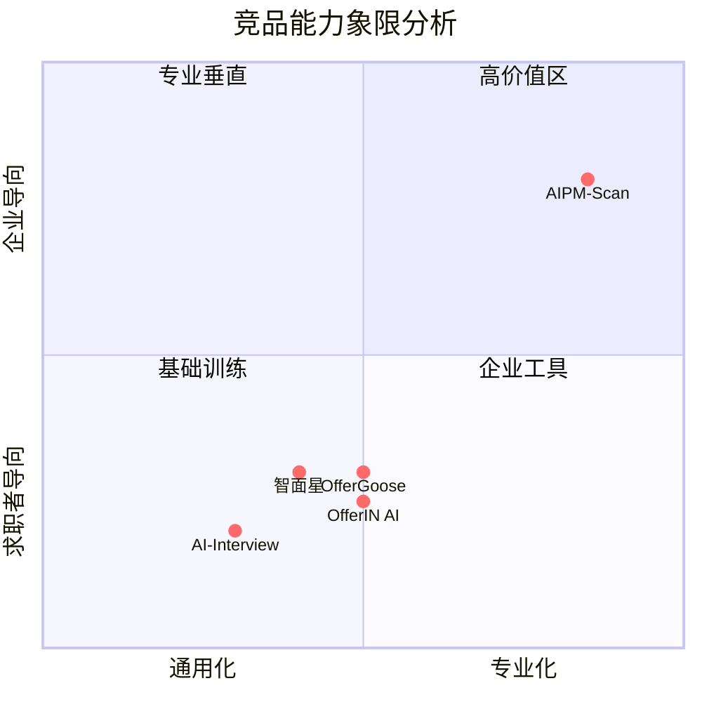
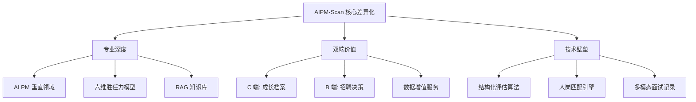

# AIPM-Scan 竞品分析报告

> **版本**：v1.0  
> **更新日期**：2026-01-10  
> **文档目标**：为 AIPM-Scan 产品定位提供专业竞品对比分析，明确差异化优势

---

## 一、产品对比范围总览

| 产品名称 | 面向对象 | 核心价值 | 支持语音/TTS | 能力评估 | 岗位匹配 | 输出报告 | RAG/知识库 |
|---------|---------|---------|------------|---------|---------|---------|-----------|
| **AIPM-Scan（本产品）** | C+B 端 | AI PM 模拟面试 + 人岗匹配 | ✅ | ✅ | ✅ | ✅ | ✅ |
| **AI-Interview** | C 端 | AI 面试对话模拟 | 部分支持 | ❌ | ❌ | ❌ | ❌ |
| **OfferGoose / 多面鹅** | C 端 | 通用 AI 面试训练 | 部分支持 | 部分支持 | ❌ | ❌ | ❌ |
| **智面星** | C 端/HR | 全职/技术面试练习 | ✅ | 部分支持 | ❌ | ❌ | ❌ |
| **OfferIN AI** | C 端 | 在线面试 + 笔试辅助 | ✅ | 部分支持 | ❌ | ❌ | ❌ |

---

## 二、竞品详细分析

### 1. AI-Interview (开源项目)

#### 产品定位
开源的通用 AI 面试模拟器，主要是面试对话生成器 + 语法纠正工具，核心是利用大模型自动提问和对话生成。

#### 优势分析
- ✅ 可直接对话练习
- ✅ 包含基础语言纠错能力
- ✅ 具备基本语音/文本交互
- ✅ 开源免费，适合个人学习

#### 劣势分析
- ❌ 无真实岗位画像生成
- ❌ 不具备结构化评估模型
- ❌ 不输出能力雷达/证据句
- ❌ 不支持匹配度算法与企业考核需求
- ❌ 不能存储、分析历史面试素材
- ❌ 缺乏专业领域深度（如 AI PM）

#### 启示与借鉴
此项目只能作为"展示对话生成"能力的参考，不足以作为能力判定核心。**不可借鉴其评估逻辑**。

---

### 2. OfferGoose / 多面鹅

#### 产品定位
面向求职者的 AI 面试训练 + 职场技能提升平台。

#### 优势分析
- ✅ 大量通用面试场景训练
- ✅ 支持一定程度智能提问
- ✅ 面试答题辅助生成建议
- ✅ 用户体验较好
- ✅ 覆盖多种职位类型

#### 劣势分析
- ❌ 通用性强但深度弱
- ❌ 无 RAG 知识库支持岗位深度
- ❌ 仅能生成模版回答与建议
- ❌ 无结构化胜任力模型
- ❌ 没有人岗匹配输出与招聘决策功能
- ❌ 缺少企业端功能

#### 竞品启示
用户留存以练习场景为主，但缺乏成长指标反馈与能力图谱。**建议本产品设计成长档案 + 复盘曲线**，提供可量化的进步轨迹。

---

### 3. 智面星

#### 产品定位
AI 面试平台 + 双语支持 + 大量题库，覆盖技术和通用职位。

#### 优势分析
- ✅ 支持多种面试场景
- ✅ 支持语音面试
- ✅ 可覆盖大部分技术/通用职位
- ✅ 双语支持（中英文）
- ✅ 题库丰富

#### 劣势分析
- ❌ 仅提供"问题+答案策略"
- ❌ 对岗位行为能力没有结构化模型
- ❌ 不支持企业对候选人评分/决策
- ❌ 没有历史能力趋势追踪
- ❌ 缺少 AI PM 等专业领域深度

#### 竞品启示
题库覆盖度广，但不够专业。**本产品需专注"AI PM 能力模型覆盖"**，在垂直领域建立壁垒。

---

### 4. OfferIN AI

#### 产品定位
在线面试平台（含笔试辅助），主要帮助求职者应对实际面试。

#### 优势分析
- ✅ 可自动识别笔试题并解析
- ✅ 提供自动回答生成
- ✅ 现实面试辅助效果强
- ✅ 实时响应能力好

#### 劣势分析
- ❌ 针对求职者场景，对企业需求覆盖很小
- ❌ 能力评估仍是基于模型输出，不系统
- ❌ 不支持人岗匹配与结构化评估
- ❌ 缺少能力成长追踪
- ❌ 无法为企业提供招聘决策支持

#### 竞品启示
提示/辅助技术可以借鉴，但**不能成为核心能力评估指标**。

---

## 三、核心能力雷达对比

### 能力评估矩阵

| 评估维度 | AI-Interview | OfferGoose | 智面星 | OfferIN AI | **AIPM-Scan** |
|---------|-------------|-----------|-------|-----------|--------------|
| **专业度** | ⭐⭐ | ⭐⭐ | ⭐⭐ | ⭐⭐ | ⭐⭐⭐⭐⭐ |
| **岗位深度** | ⭐ | ⭐ | ⭐ | ⭐ | ⭐⭐⭐⭐⭐ |
| **RAG 支持** | ❌ | ❌ | ❌ | ❌ | ✅ |
| **能力结构化** | ❌ | ❌ | ❌ | ❌ | ✅ |
| **企业匹配** | ❌ | ❌ | ❌ | ❌ | ✅ |
| **成长雷达** | ❌ | ⭐ | ⭐ | ⭐ | ✅ |
| **数据复盘** | ❌ | ⭐ | ⭐ | ⭐ | ✅ |
| **职业转型支持** | ⭐ | ⭐ | ⭐ | ⭐ | ⭐⭐⭐⭐ |

### 能力雷达可视化

---

## 四、核心差异化分析

### 竞品共同缺失 vs AIPM-Scan 核心价值

| 竞品普遍缺失 | AIPM-Scan 独特价值 |
|------------|------------------|
| ❌ 没有岗位画像 | ✅ 基于 JD 自动生成能力权重体系 |
| ❌ 没有定量评估 | ✅ 六维胜任力评分 + 证据句 |
| ❌ 无企业决策支持 | ✅ 匹配度 + 风险报告 + 导出 PDF |
| ❌ 无结构化知识库 | ✅ RAG 驱动答案与题目生成 |
| ❌ 无可追踪能力档案 | ✅ 历史趋势 + 成长路线 |
| ❌ 不支持 B 端场景 | ✅ 企业账号 + 多面试官协作 |
| ❌ 缺少视频面试素材保存 | ✅ 完整面试录制 + 回放分析 |

### 差异化优势总结

---

## 五、战略定位与竞争策略

### 产品定位声明

> **AIPM-Scan 不是另一个"通用 AI 面试"产品**
> 
> 而是：
> **AI 产品经理能力识别与岗位匹配系统 + 面试训练系统集合体**

### 核心竞争优势

1. **高壁垒**
   - RAG 驱动的专业知识库
   - 结构化能力评估算法
   - 六维胜任力模型

2. **高专业度**
   - 专注 AI PM 垂直领域
   - 基于真实岗位需求
   - 证据驱动的评估体系

3. **高商业价值**
   - C 端：职业成长工具
   - B 端：招聘决策平台
   - 数据增值服务潜力

### 竞争策略建议

#### 短期策略（3-6 个月）
1. **建立垂直壁垒** - 深耕 AI PM 能力模型，积累专业题库
2. **打造 MVP** - 优先完成核心评估引擎和 C 端体验
3. **获取种子用户** - 目标：500+ AI PM 从业者/求职者

#### 中期策略（6-12 个月）
1. **拓展 B 端** - 与 10+ 科技企业合作，验证招聘价值
2. **数据飞轮** - 通过面试数据优化评估模型
3. **品牌建设** - 成为"AI PM 能力标准"的定义者

#### 长期策略（12+ 个月）
1. **横向扩展** - 覆盖更多 AI 相关职位（AI 工程师、数据科学家等）
2. **纵向深化** - 提供职业发展路径规划、培训课程推荐
3. **生态构建** - 打通招聘平台、培训机构、企业 HR 系统

---

## 六、关键结论

### 市场机会

- ✅ **市场空白明显** - 无专注 AI PM 垂直领域的专业产品
- ✅ **需求真实存在** - AI PM 岗位快速增长，人才供需不匹配
- ✅ **技术可行** - RAG、LLM、语音识别等技术已成熟
- ✅ **商业模式清晰** - C 端订阅 + B 端 SaaS

### 风险与挑战

- ⚠️ **冷启动难题** - 初期知识库和题库需人工标注
- ⚠️ **评估准确性** - 能力评估的主观性如何量化
- ⚠️ **用户教育成本** - B 端企业对 AI 面试接受度
- ⚠️ **竞品快速跟进** - 通用平台可能复制模式

### 成功关键要素

1. **专业深度** - 在 AI PM 领域建立不可替代的专业性
2. **评估可信度** - 证明评估结果与真实表现的相关性
3. **用户体验** - C 端流畅的面试体验，B 端高效的决策支持
4. **数据积累** - 快速积累高质量面试数据，形成壁垒

---

## 附录：竞品功能对比详表

| 功能模块 | AI-Interview | OfferGoose | 智面星 | OfferIN AI | AIPM-Scan |
|---------|-------------|-----------|-------|-----------|-----------|
| 文本对话 | ✅ | ✅ | ✅ | ✅ | ✅ |
| 语音对话 | 部分 | 部分 | ✅ | ✅ | ✅ |
| 视频录制 | ❌ | ❌ | ❌ | ❌ | ✅ |
| 自定义岗位 | ❌ | 部分 | ❌ | ❌ | ✅ |
| 能力评分 | ❌ | 简单 | 简单 | 简单 | 六维结构化 |
| 证据句抽取 | ❌ | ❌ | ❌ | ❌ | ✅ |
| 历史记录 | ❌ | ✅ | ✅ | ✅ | ✅ |
| 成长趋势 | ❌ | 部分 | 部分 | 部分 | ✅ |
| 企业端 | ❌ | ❌ | ❌ | ❌ | ✅ |
| 报告导出 | ❌ | ❌ | ❌ | ❌ | ✅ |
| RAG 知识库 | ❌ | ❌ | ❌ | ❌ | ✅ |
| 多语言支持 | 部分 | 部分 | ✅ | ✅ | 规划中 |

---

**文档结束**
