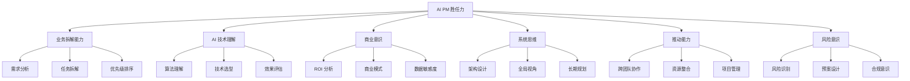
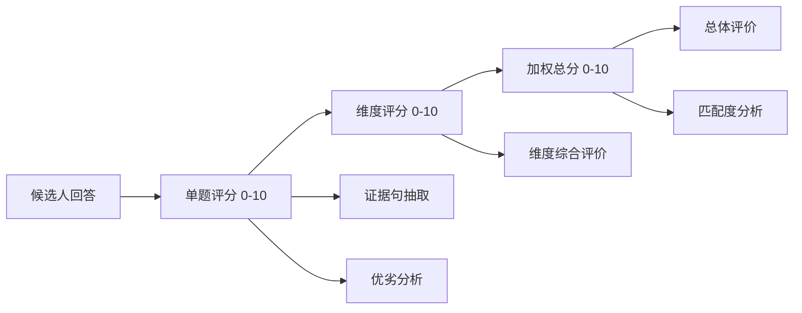

# AIPM-Scan 能力模型标注规范

> **版本**：v1.0  
> **更新日期**：2026-01-10  
> **用途**：为知识库数据标注、面试评估、报告生成提供统一标准

---

## 📋 目录

1. [能力模型总览](#一能力模型总览)
2. [六维能力详细定义](#二六维能力详细定义)
3. [评分标准](#三评分标准)
4. [证据句标注规则](#四证据句标注规则)
5. [标注示例](#五标注示例)
6. [质量控制](#六质量控制)

---

## 一、能力模型总览

### 1.1 AI 产品经理六维胜任力模型



### 1.2 维度权重范围

| 能力维度 | 典型权重范围 | 说明 |
|---------|------------|------|
| 业务拆解能力 | 15-30% | 所有 AI PM 岗位的基础能力 |
| AI 技术理解 | 20-35% | 核心差异化能力 |
| 商业意识 | 10-20% | 战略导向岗位权重更高 |
| 系统思维 | 15-25% | 架构型 PM 权重更高 |
| 推动能力 | 10-20% | 执行导向岗位权重更高 |
| 风险意识 | 5-15% | 金融、医疗等领域权重更高 |

> **注**：六维权重总和必须为 100%

---

## 二、六维能力详细定义

### 2.1 业务拆解能力

#### 定义
将复杂的业务问题、用户需求或产品目标，系统化地分解为可执行的任务、可衡量的指标和清晰的实施路径。

#### 核心考察点

| 子能力 | 描述 | 关键词 |
|-------|------|-------|
| **需求分析** | 理解真实需求 vs 表面需求 | 用户洞察、需求挖掘、5W1H |
| **任务拆解** | 分解为可执行单元 | WBS、里程碑、依赖关系 |
| **优先级排序** | 基于影响和成本排序 | RICE、MoSCoW、价值排序 |
| **可行性评估** | 技术、资源、时间的现实性 | MVP、POC、渐进式交付 |

#### 典型面试题示例

**基础题**：
> 如果要为一个电商平台设计个性化推荐功能，你会如何拆解这个需求？

**进阶题**：
> 描述一个你负责的 AI 项目，说明你如何从业务目标出发，拆解为技术任务和里程碑的。

**高级题**：
> 公司要在 3 个月内上线一个 AI 客服系统，但资源有限。你会如何拆解优先级，确保核心价值交付？

#### 评分维度

| 得分区间 | 表现特征 |
|---------|---------|
| 9-10 分 | 能够多层次拆解，考虑依赖关系和风险，提出创新方法 |
| 7-8 分 | 拆解结构清晰，覆盖主要任务，有优先级意识 |
| 5-6 分 | 能拆解基本任务，但遗漏关键环节或优先级不明 |
| 3-4 分 | 拆解表面化，缺乏深度和逻辑性 |
| 0-2 分 | 无法有效拆解，答非所问 |

---

### 2.2 AI 技术理解

#### 定义
对人工智能技术原理、应用场景、局限性的理解深度，以及在产品决策中应用技术知识的能力。

#### 核心考察点

| 子能力 | 描述 | 关键词 |
|-------|------|-------|
| **算法理解** | 主流 AI 算法的原理和适用场景 | 监督学习、NLP、CV、推荐系统 |
| **技术选型** | 根据场景选择合适技术方案 | 开源 vs 商业、云 vs 本地、模型选型 |
| **效果评估** | 理解并定义 AI 效果指标 | 准确率、召回率、F1、A/B测试 |
| **技术边界** | 认识 AI 能做什么、不能做什么 | 可解释性、数据依赖、冷启动 |

#### 典型面试题示例

**基础题**：
> 请解释什么是监督学习和无监督学习，并各举一个在产品中的应用例子。

**进阶题**：
> 你负责一个文本分类项目，模型准确率达到 85%，但线上效果不理想。你会如何分析和优化？

**高级题**：
> 公司想做一个"AI 生成营销文案"的功能。从技术选型到效果评估，你会如何规划整个方案？

#### 评分维度

| 得分区间 | 表现特征 |
|---------|---------|
| 9-10 分 | 技术理解深入，能结合业务灵活应用，有技术前瞻性 |
| 7-8 分 | 理解主流技术，能做合理选型，熟悉效果评估 |
| 5-6 分 | 了解基本概念，但应用能力有限 |
| 3-4 分 | 概念模糊，缺乏实践经验 |
| 0-2 分 | 技术理解严重不足 |

---

### 2.3 商业意识

#### 定义
理解产品的商业价值、成本结构、ROI，并能在产品决策中平衡用户价值和商业价值。

#### 核心考察点

| 子能力 | 描述 | 关键词 |
|-------|------|-------|
| **ROI 分析** | 成本收益分析，量化价值 | 投入产出比、商业价值、效率提升 |
| **商业模式** | 理解盈利模式和增长逻辑 | 付费转化、LTV、获客成本 |
| **数据敏感度** | 用数据驱动决策 | 指标定义、数据分析、增长黑客 |
| **竞争分析** | 了解市场和竞品动态 | 差异化、护城河、市场定位 |

#### 典型面试题示例

**基础题**：
> 如何评估一个 AI 功能是否值得投入开发？

**进阶题**：
> 你负责的推荐系统使点击率提升了 15%，请分析这对业务的价值，并设计 ROI 评估方案。

**高级题**：
> 公司有两个 AI 项目候选：A 项目能降低 20% 人工成本，B 项目能提升 10% 用户留存。如何决策？

#### 评分维度

| 得分区间 | 表现特征 |
|---------|---------|
| 9-10 分 | 商业思维敏锐，能量化价值，平衡长短期利益 |
| 7-8 分 | 有 ROI 意识，能做基本成本分析 |
| 5-6 分 | 认识到商业重要性，但缺少量化方法 |
| 3-4 分 | 商业思维薄弱，过于产品或技术导向 |
| 0-2 分 | 完全忽视商业价值 |

---

### 2.4 系统思维

#### 定义
从全局视角思考问题，设计可扩展的产品架构，考虑系统边界和长期演进。

#### 核心考察点

| 子能力 | 描述 | 关键词 |
|-------|------|-------|
| **架构设计** | 模块化、可扩展的产品设计 | 解耦、服务化、中台思维 |
| **全局视角** | 考虑上下游和生态 | 生态系统、平台化、多方利益 |
| **长期规划** | 兼顾当前和未来 | 技术债、迁移成本、可持续性 |
| **边界意识** | 明确系统边界和外部依赖 | 接口设计、降级策略、容错 |

#### 典型面试题示例

**基础题**：
> 设计一个 AI 内容审核系统时，需要考虑哪些模块和边界？

**进阶题**：
> 你负责的推荐系统需要接入多个业务场景（电商、资讯、短视频）。如何设计系统架构？

**高级题**：
> 公司计划从单一大模型切换到多模型混合架构。从产品视角，你会如何规划这次演进？

#### 评分维度

| 得分区间 | 表现特征 |
|---------|---------|
| 9-10 分 | 架构思维清晰，考虑全面，有前瞻性 |
| 7-8 分 | 有系统设计能力，考虑主要边界 |
| 5-6 分 | 基本的模块化思维，但不够全面 |
| 3-4 分 | 思考局限于单点，缺乏全局观 |
| 0-2 分 | 完全没有系统思维 |

---

### 2.5 推动能力

#### 定义
跨团队协作、资源整合、项目推进和冲突处理的能力。

#### 核心考察点

| 子能力 | 描述 | 关键词 |
|-------|------|-------|
| **跨团队协作** | 与研发、运营、市场等团队协作 | 沟通、对齐、共识 |
| **资源整合** | 争取和调配资源 | 优先级、资源争取、外部合作 |
| **项目管理** | 把控进度、风险和质量 | 里程碑、进度跟踪、风险管理 |
| **冲突处理** | 化解分歧，达成一致 | 利益平衡、妥协、说服 |

#### 典型面试题示例

**基础题**：
> 在 AI 项目中，你通常如何与算法团队协作？

**进阶题**：
> 项目中期，算法团队说需要延期 2 周调优模型，但业务方要求按时上线。你会怎么处理？

**高级题**：
> 描述一次你推动的跨部门 AI 项目，遇到了哪些阻力，如何克服的？

#### 评分维度

| 得分区间 | 表现特征 |
|---------|---------|
| 9-10 分 | 推动能力强，善于协调资源和化解冲突 |
| 7-8 分 | 能有效协作，项目推进顺利 |
| 5-6 分 | 基本的协作能力，但遇到困难时效率不高 |
| 3-4 分 | 协作能力弱，项目常延期或卡壳 |
| 0-2 分 | 无法有效推动工作 |

---

### 2.6 风险意识

#### 定义
识别产品、技术、合规等方面的潜在风险，并制定预案和应对策略。

#### 核心考察点

| 子能力 | 描述 | 关键词 |
|-------|------|-------|
| **风险识别** | 提前发现潜在问题 | 技术风险、业务风险、合规风险 |
| **预案设计** | 制定备选方案和降级策略 | Plan B、降级、AB测试 |
| **合规意识** | 数据隐私、算法公平性等 | GDPR、算法偏见、用户隐私 |
| **应急响应** | 线上问题快速响应 | 监控告警、快速止损、复盘 |

#### 典型面试题示例

**基础题**：
> AI 推荐系统可能存在哪些风险？

**进阶题**：
> 你的 AI 客服系统上线后，被用户发现会输出不当内容。你会如何应对？

**高级题**：
> 设计一个人脸识别产品时，需要考虑哪些合规和伦理风险？如何规避？

#### 评分维度

| 得分区间 | 表现特征 |
|---------|---------|
| 9-10 分 | 风险意识强，预案充分，考虑合规和伦理 |
| 7-8 分 | 能识别主要风险，有基本预案 |
| 5-6 分 | 有风险意识，但不够全面 |
| 3-4 分 | 风险意识薄弱，忽视潜在问题 |
| 0-2 分 | 完全没有风险意识 |

---

## 三、评分标准

### 3.1 总体评分体系



### 3.2 评分等级定义

| 分数 | 等级 | 定义 | 录用建议 |
|-----|------|------|---------|
| **9.0-10.0** | 优秀 (Excellent) | 深刻理解，有独到见解，超出预期 | 强烈推荐 |
| **8.0-8.9** | 优良 (Very Good) | 理解准确，表达清晰，有亮点 | 推荐 |
| **7.0-7.9** | 良好 (Good) | 掌握要点，有实践经验，可用 | 推荐（可能需培养） |
| **6.0-6.9** | 合格 (Acceptable) | 基本理解，有遗漏，需提升 | 观察（视团队情况） |
| **5.0-5.9** | 待提升 (Need Improvement) | 理解不足，关键点缺失 | 不推荐 |
| **0-4.9** | 不合格 (Poor) | 严重理解偏差或无法回答 | 不推荐 |

### 3.3 评分校准机制

#### 标杆答案法
每个题目预设 3 档标杆答案：
- **优秀档**（8-10分）：包含的关键点和深度
- **合格档**（6-7分）：必须包含的基本点
- **不合格档**（<6分）：缺失关键点的情况

#### 双盲评估
- 同一回答由 **AI + 人工** 双重评分
- 分差 > 2 分时触发复审
- 每月标定 20% 样本用于模型校准

---

## 四、证据句标注规则

### 4.1 证据句定义

**证据句**：从候选人回答中提取的、能够直接支持评分判断的关键句子或片段。

### 4.2 标注原则

| 原则 | 说明 | 示例 |
|-----|------|------|
| **原文引用** | 必须原样引用，不可改写 | ✓「我们通过 A/B 测试验证」 ✗ 候选人提到了测试 |
| **关键性** | 代表核心能力点 | ✓ 体现算法理解 ✗ 无关寒暄 |
| **简洁性** | 一般不超过 30 字 | 可截取关键片段 |
| **正负兼顾** | 既要体现亮点，也要指出不足 | 亮点 2 条 + 不足 1 条 |

### 4.3 标注格式

```
【证据句1】「用户回答原文」
- 类型：亮点✓ / 不足✗
- 体现能力：{维度名称}
- 说明：为什么这句话重要（20字以内）

【证据句2】...
```

### 4.4 标注示例

**候选人回答**（部分）：
> "我们发现推荐系统在冷启动用户上效果不佳，所以设计了基于内容的混合策略，同时考虑了用户隐私问题，避免过度收集数据。通过 A/B 测试，新策略使新用户留存提升了 12%。"

**证据句标注**：

```
【证据句1】「设计了基于内容的混合策略」
- 类型：亮点✓
- 体现能力：AI 技术理解
- 说明：针对冷启动问题提出技术方案

【证据句2】「同时考虑了用户隐私问题」
- 类型：亮点✓
- 体现能力：风险意识
- 说明：主动考虑合规和伦理

【证据句3】「通过 A/B 测试...留存提升了 12%」
- 类型：亮点✓
- 体现能力：商业意识
- 说明：用数据量化业务价值
```

---

## 五、标注示例

### 5.1 完整标注案例

**面试题**：
> 请描述一个你负责的 AI 推荐系统项目，包括遇到的挑战和解决方案。

**候选人回答**：
> "我负责过某电商 App 的推荐系统优化。当时主要挑战是点击率 CTR 提升遇到瓶颈。我们分析发现，传统的协同过滤算法在长尾商品上效果不好。于是我提出了 '双塔模型 + 多目标优化' 的方案，同时优化点击和转化。技术上选择了 Wide & Deep 架构，并引入了商品知识图谱作为 side information。项目周期 3 个月，需要协调算法、工程和数据团队。上线后 CTR 提升 8%，GMV 增长 5%，ROI 达到预期。但也暴露了模型可解释性不足的问题，后续我们增加了特征重要性分析功能。"

**AI 评估输出**：

```json
{
  "scores": {
    "business_decomposition": 7.5,
    "ai_tech_understanding": 8.5,
    "business_awareness": 8.0,
    "system_thinking": 7.0,
    "execution_power": 7.5,
    "risk_awareness": 6.5
  },
  "overall_score": 7.7,
  
  "evidence_analysis": {
    "business_decomposition": {
      "score": 7.5,
      "evidence": [
        "「分析发现，传统的协同过滤算法在长尾商品上效果不好」- 问题定位清晰✓",
        "「项目周期 3 个月，需要协调算法、工程和数据团队」- 有项目拆解意识✓"
      ],
      "comment": "能够识别问题并拆解任务，但缺少更细粒度的里程碑描述"
    },
    
    "ai_tech_understanding": {
      "score": 8.5,
      "evidence": [
        "「双塔模型 + 多目标优化」- 技术方案专业✓",
        "「Wide & Deep 架构，并引入了商品知识图谱」- 深度理解推荐技术✓"
      ],
      "comment": "技术理解深入，方案设计合理，展现了对前沿技术的掌握"
    },
    
    "business_awareness": {
      "score": 8.0,
      "evidence": [
        "「CTR 提升 8%，GMV 增长 5%」- 用业务指标衡量价值✓",
        "「ROI 达到预期」- 有投入产出意识✓"
      ],
      "comment": "能够量化业务价值，商业思维清晰"
    },
    
    "system_thinking": {
      "score": 7.0,
      "evidence": [
        "「引入了商品知识图谱作为 side information」- 考虑系统扩展性✓",
        "缺少：未提及系统架构和长期演进规划✗"
      ],
      "comment": "有一定系统设计能力，但未体现全局架构思维"
    },
    
    "execution_power": {
      "score": 7.5,
      "evidence": [
        "「需要协调算法、工程和数据团队」- 跨团队协作✓",
        "「项目周期 3 个月」- 有时间管理意识✓"
      ],
      "comment": "推动能力良好，但未深入描述如何处理团队协作挑战"
    },
    
    "risk_awareness": {
      "score": 6.5,
      "evidence": [
        "「暴露了模型可解释性不足的问题」- 事后风险识别✓",
        "缺少：未提及上线前的风险预案✗"
      ],
      "comment": "能够复盘问题，但缺少事前风险意识"
    }
  },
  
  "summary": "候选人展现了扎实的 AI 技术功底和良好的商业意识，项目经验丰富。技术方案设计专业，能够量化业务价值。需要提升的方面包括：系统架构思维、事前风险管控。整体表现良好，建议录用。",
  
  "strengths": [
    "AI 技术理解深入，熟悉推荐系统前沿技术",
    "商业意识强，能用数据衡量价值",
    "有完整项目经验，跨团队协作能力良好"
  ],
  
  "improvements": [
    "加强系统架构和长期规划能力",
    "提升事前风险识别和预案设计",
    "在项目拆解中更注重细粒度的里程碑管理"
  ]
}
```

---

## 六、质量控制

### 6.1 标注质量检查清单

#### 评分一致性
- [ ] 同维度不同题目评分标准一致
- [ ] 证据句充分支持评分
- [ ] 无明显评分偏高/偏低

#### 证据句质量
- [ ] 直接引用原文，无改写
- [ ] 证据句有代表性
- [ ] 正负面都有覆盖

#### 评价客观性
- [ ] 避免主观臆断
- [ ] 基于知识库和标准
- [ ] 建设性而非批判性

### 6.2 标注员培训要求

#### 必备知识
- AI PM 岗位职责理解
- 六维能力模型深入理解
- 主流 AI 技术基础知识

#### 标注训练
1. 学习标注规范（本文档）
2. 完成 20 个标注练习
3. 通过一致性测试（与标准答案偏差 < 1 分）

### 6.3 抽检机制

| 抽检比例 | 抽检方式 | 处理 |
|---------|---------|------|
| 10% | 每周随机抽检 | 发现问题及时纠正 |
| 100% | 分差 > 2 分的案例 | 专家复审 |
| 20% | 每月专家标定 | 用于模型校准 |

---

## 七、附录

### A. 常见标注错误

| 错误类型 | 示例 | 正确做法 |
|---------|------|---------|
| **改写原文** | ✗ 候选人提到了 A/B 测试 | ✓「我们通过 A/B 测试」|
| **证据不足** | ✗ 技术理解不错 | ✓ 提及了 Wide & Deep，得分 8.5 |
| **主观臆断** | ✗ 看起来经验不足 | ✓ 未提及具体项目，得分 5.0 |
| **评分不一致** | ✗ 同样表现，不同题目分数差异大 | ✓ 参照评分标准 |

### B. 标注工具推荐

- **Label Studio**：开源标注平台
- **Prodigy**：NLP 友好的标注工具
- **内部工具**：定制化标注界面

---

**文档结束**
